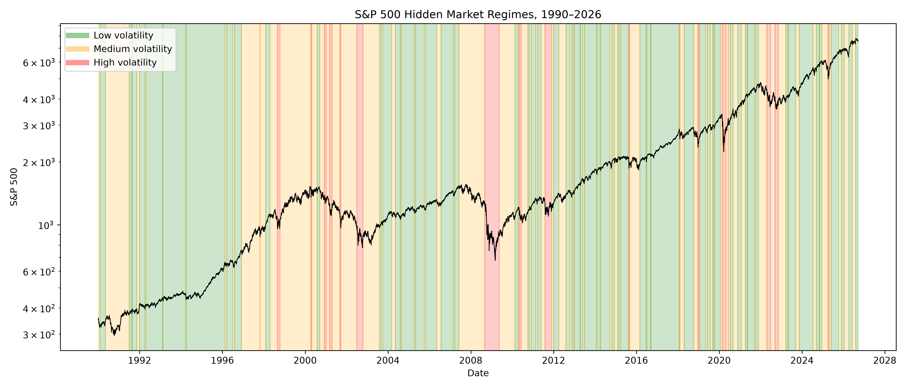
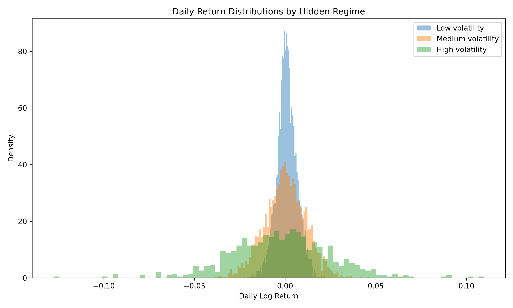
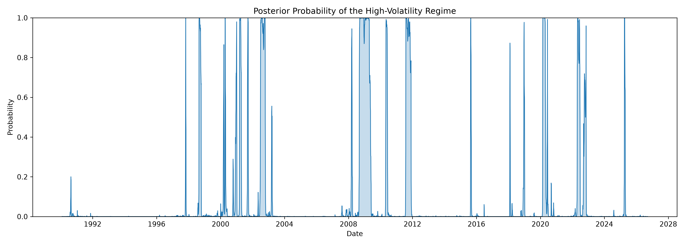
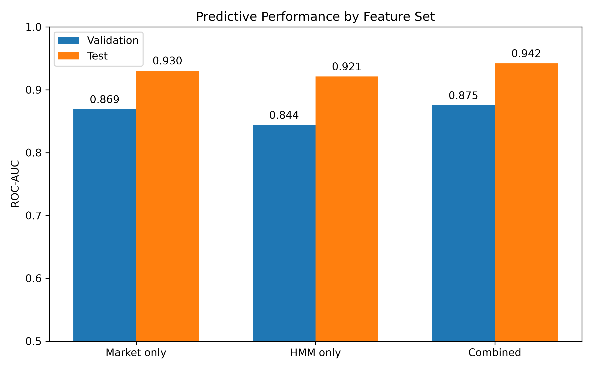
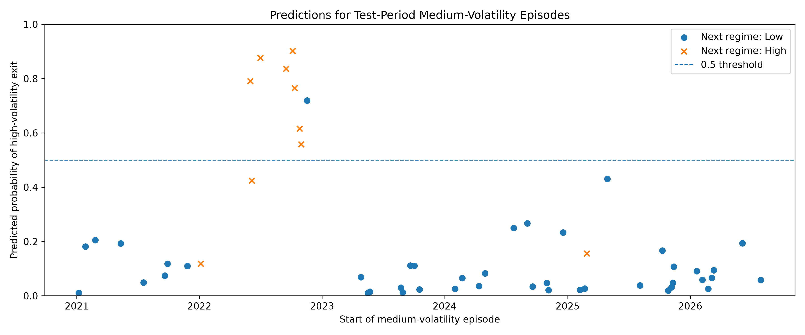
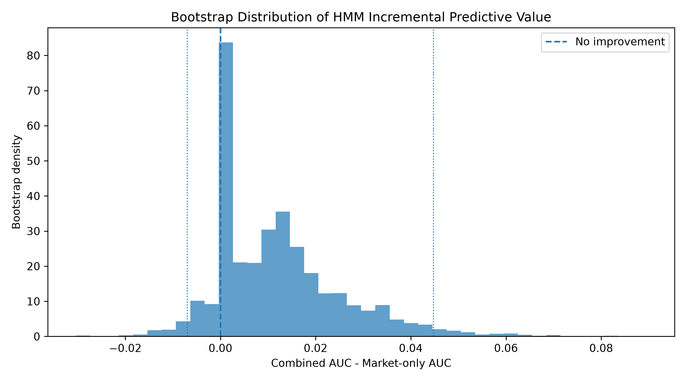

## Summary

The project started with a simple idea, which was to use a Hidden Markov Model to identify different market regimes in the S&P 500. The initial ideas was just to classify regime changes using all available information, hence the model was fitted for the entire dataset 1990-2026. I gave the HMM two inputs: log-returns and 20-day rolling volatility. The model produced very clear low-, medium- and high-volatiltiy regimes. However, realizing that the model based it largely on the 20-day rolling volatility, the rolling volatility was removed from the model. Therefore HMM was fit using only return:

$$
r_t\mid Z_t=k\sim N(\mu_k,\sigma_k^2),
$$

with hidden states $Z_t \in \{1,2,3\},$ which followed the Markov chain $A_{ij} = P(Z_{t+1}=j \mid Z_t=i).$ Then I decided to extend the project to make a predictive model. Hence I rewrote the code for the HMM, so that regime probabilities at time $t$ only used information available up to time $t$. The data was split into

$$
1990\text{--}2015 \quad \text{training},
$$

$$
2016\text{--}2020 \quad \text{validation},
$$

$$
2021\text{--}2026 \quad \text{test}.
$$

Then defined

$$
Y_t=
\begin{cases}
1,&\text{if the next non-medium regime is high volatility},\\
0,&\text{if the next non-medium regime is low volatility}.
\end{cases}
$$

For each medium-regime observation, features was constructed:

- $r_t$, 5- and 20-day cumulative returns,
- $R_{5,t},\quad R_{20,t}$, short- and medium-term realized volatility,
- $\sigma_{5,t},\quad \sigma_{20,t}$, volatility change,
- $\sigma_{5,t}-\sigma_{20,t}$,
- recent drawdown,
- time already spent in the medium regime,
- the filtered HMM probabilities.

Then trained a logisitic regression model, which obtained strong out-of-sample performance. But most of the observations came from the same medium-volatiltiy episode and were therefore highly correlated. To make evaluation stricter, each continous medium-volatility episode was reduced to the observation of the first day. The model still performed well with validation ROC-AUC = 0.81 and test ROC-AUC = 0.93, which suggests that the predictive signal was not simply from repeated observations from the sam episode.

To asses if HMM added any predictive value, three models were compared:

- Market features only,
- HMM features only,
- Market + HMM features.

The combined model performed best with test AUC_market = 0.93, test AUC_HMM = 0.92 and test AUC_combined = 0.94. The combined model also had the best Brier score. Finally, to quantify uncertainty bootstrap resampling at the episode level was performed. The combined model had a higher observed AUC than the market-only model, but the 95% bootstrap interval for the AUC difference crossed zero: $[-0.007, 0.045].$ The Brier-score result was more favorable, which produced better probability forecasts in about 92% of bootstrap samples.

## Initial Project

### Model

Daily log returns are defined as

$$
r_t = \log\left(\frac{P_t}{P_{t-1}}\right).
$$

The hidden market state is

$$
Z_t \in \{1,2,3\},
$$

with Markov dynamics

$$
P(Z_t \mid Z_{t-1}, Z_{t-2}, \ldots) = P(Z_t \mid Z_{t-1}).
$$

Conditional on the hidden state,

$$
r_t \mid Z_t=k
\sim
\mathcal{N}(\mu_k,\sigma_k^2).
$$

The transition probabilities are

$$
A_{ij} = P(Z_{t+1}=j \mid Z_t=i).
$$

### Results

### Hidden market regimes



### Return distributions by regime



### Transition probabilities


### High-volatility regime probability



## Predictive model

### Filtering

For the predictive version, the hidden state probabilities are computed recursively using only information available up to time $t$.

Let

$$
\alpha_t(k) = P(Z_t=k\mid r_1,\ldots,r_t).
$$

Before observing $r_t$, the one-step predicted state probabilities are

$$
P(Z_t=j\mid r_1,\ldots,r_{t-1}) = \sum_i \alpha_{t-1}(i)A_{ij}.
$$

After observing the return $r_t$, the probabilities are updated using the Gaussian emission density,

$$
f_j(r_t) = \frac{1}{\sqrt{2\pi\sigma_j^2}} \exp\left( -\frac{(r_t-\mu_j)^2}{2\sigma_j^2} \right).
$$

Hence,

$$
\alpha_t(j) = \frac{ f_j(r_t) \sum_i \alpha_{t-1}(i)A_{ij} }{ \sum_{\ell} f_{\ell}(r_t) \sum_i \alpha_{t-1}(i)A_{i\ell}
}.
$$

This is different from the retrospective HMM, since no observations after time $t$ enter the calculation.

### Logistic regression

The transition model is a binary logistic regression,

$$
P(Y_t=1\mid X_t) = \frac{1}{1+\exp(-\beta_0-\beta^\top X_t)}.
$$

Here $Y_t=1$ corresponds to the medium-volatility regime eventually exiting toward the high-volatility regime.

The coefficients therefore describe how each standardized feature changes the log-odds

$$
\log \left(\frac{P(Y_t=1\mid X_t)}{1-P(Y_t=1\mid X_t)}\right)=\beta_0+\beta^\top X_t.
$$

In the first day-level model, some of the largest coefficients were associated with drawdown and recent volatility, suggesting that deeper drawdowns and higher volatility contained useful information about the direction of the next regime transition.

### Episode-level setup

Since consecutive observations inside the same medium-volatility period are strongly dependent, the final evaluation uses one observation per continuous medium-volatility episode.

For an episode

$$
M,M,\ldots,M,
$$

only the first observation is retained. The target depends on whether the first subsequent non-medium state is

$$
L
$$

or

$$
H.
$$

This resulted in:

| Split | Medium-regime episodes | High-volatility exits |
|---|---:|---:|
| Training | 208 | about 22.6% |
| Validation | 28 | 8 |
| Test | 53 | 10 |

This makes the evaluation substantially stricter than treating every medium-regime day as an independent observation.

### Model comparison

Three versions of the logistic regression model were estimated:

1. **Market model** — uses only return, volatility and drawdown variables.
2. **HMM model** — uses only filtered HMM state probabilities.
3. **Combined model** — uses both sets of features.

The episode-level test results were:

| Model | ROC-AUC | PR-AUC | Brier score |
|---|---:|---:|---:|
| Market only | 0.9302 | 0.7661 | 0.0810 |
| HMM only | 0.9209 | 0.8242 | 0.0679 |
| Combined | **0.9419** | **0.8482** | **0.0663** |

The combined model therefore had the highest observed ROC-AUC and PR-AUC and the lowest Brier score.

The validation ROC-AUC values were:

| Model | Validation ROC-AUC |
|---|---:|
| Market only | 0.8688 |
| HMM only | 0.8438 |
| Combined | **0.8750** |

### Bootstrap uncertainty

Because the test set contained only 53 independent medium-volatility episodes, bootstrap resampling was used to quantify uncertainty.

For the combined model, AUC_bined - AUC_market had a 95% bootstrap interval of $[-0.0070,\;0.0447].$

Since the interval includes zero, the observed increase in ROC-AUC is not sufficiently precise to establish that the HMM component improves ranking performance.

The bootstrap probability that AUC_combined > AUC_market was approximately $0.731.$

For the Brier score, the evidence was stronger. The combined model had a lower Brier score than the market-only model in approximately

$$
92.4\%
$$

of bootstrap samples.

This suggests that the HMM probabilities may contribute more to the quality of the predicted probabilities than to the ranking of high- versus low-volatility transitions.

### Predictive results

The combined model achieved the strongest overall predictive performance, although the improvement over the market-only model was relatively small.

#### Feature-set comparison



The combined market + HMM model achieved the highest ROC-AUC on both the validation and test sets.

#### Test-period episode predictions



The model assigns a probability that each medium-volatility episode will transition to the high-volatility regime. High-volatility exits are relatively rare and are concentrated in parts of the test period.

#### Bootstrap uncertainty



Most bootstrap samples favor the combined model, but the 95% interval crosses zero, so the improvement in ROC-AUC is not statistically conclusive.

## Project structure

```text
HMM-market-regime-detection/
│
├── src/
│   ├── 01_download_data.py
│   ├── 02_prepare_returns.py
│   ├── 03_fit_hmm.py
│   ├── 04_model_selection.py
│   └── 05_figures.py
│
├── predictive/
│   ├── 01_split_data.py
│   ├── 02_fit_hmm_train.py
│   ├── 03_filter_regimes.py
│   ├── 04_prediction_data.py
│   ├── 05_train_classifier.py
│   ├── 06_evaluation.py
│   ├── 07_compare_feature_sets.py
│   ├── 08_bootstrap_uncertainty.py
│   └── 09_predictive_figures.py
│
├── figures/
│   ├── market_regimes.png
│   ├── return_distributions.png
│   ├── transition_matrix.png
│   ├── high_volatility_probability.png
│   └── predictive/
│       ├── feature_set_auc.png
│       ├── test_episode_predictions.png
│       └── bootstrap_auc_difference.png
│
├── README.md
├── requirements.txt
└── .gitignore
```
