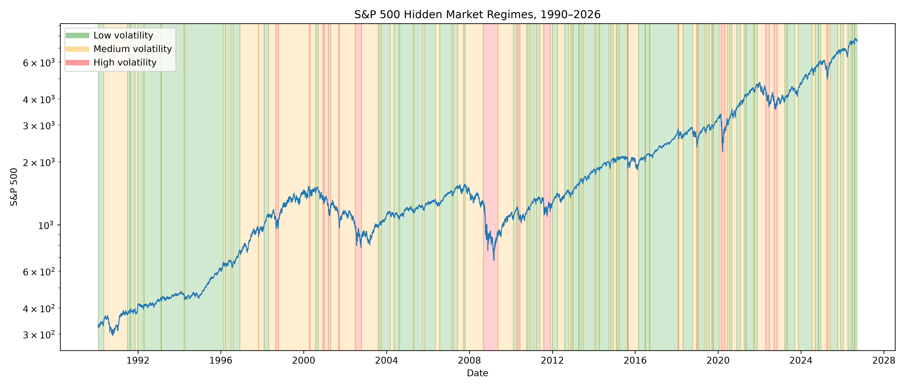
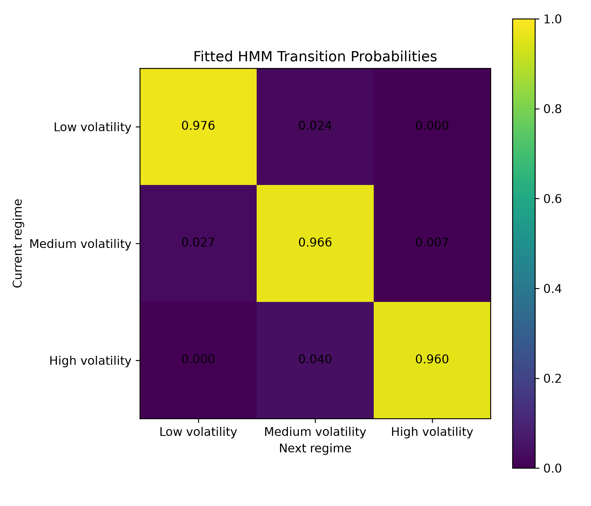

# Hidden Markov Model for Market Regime Detection

This project uses a Gaussian Hidden Markov Model to identify latent volatility regimes in daily S&P 500 returns from 1990 onward.

The model is trained using daily log returns only. The hidden states are interpreted after estimation as low-, medium-, and high-volatility market regimes.

## Model

Daily log returns are defined as

$$
r_t = \log\left(\frac{P_t}{P_{t-1}}\right).
$$

The hidden market state is

$$
Z_t \in \{1,2,3\},
$$

with Markov dynamics

$$
P(Z_t \mid Z_{t-1}, Z_{t-2}, \ldots)
=
P(Z_t \mid Z_{t-1}).
$$

Conditional on the hidden state,

$$
r_t \mid Z_t=k
\sim
\mathcal{N}(\mu_k,\sigma_k^2).
$$

The transition probabilities are

$$
A_{ij}
=
P(Z_{t+1}=j \mid Z_t=i).
$$

## Results

### Hidden market regimes



### Return distributions by regime


### HMM transition probabilities



### Probability of high-volatility regime


## Project structure

```text
src/
├── 01_download_data.py
├── 02_prepare_returns.py
├── 03_fit_hmm.py
├── 04_model_selection.py
└── 05_figures.py
